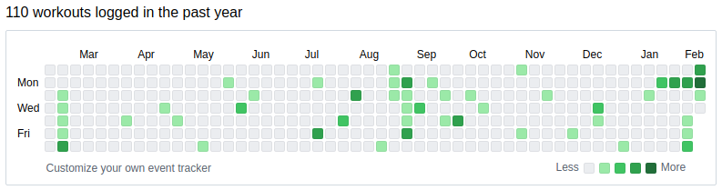

This project can be used to track custom events and visualize them in a familiar GitHub-style contributions graph.

<p align="center">
  
</p>

### Overview

Data can be displayed in two ways:

* Gradient style: Stores integer values to represent the number of events on each day
* Boolean style: Stores one event value on each day

### Getting started

Include the CSS and script tag in the html header:

````
<link rel="stylesheet"
  href="https://raw.githubusercontent.com/dysproseum/github-contributions/refs/heads/main/contrib.css" />
<script type="text/javascript"
  src="https://raw.githubusercontent.com/dysproseum/github-contributions/refs/heads/main/contrib.js">
</script>
````

By default, the component will bind to an element with id `github-contrib`. Also add the `github-contrib` class to set the styling:

````
<div id="github-contrib" class="github-contrib">
````

By passing `options` you can set the graph style, customize colors, event series, and title.

When embedding more than one graph on a page, make sure to specify a unique `targetId` attribute in the options:

````
const options = {
  'targetId' => 'github-custom',
};
let contrib = new GithubContributions(); // Defaults for demonstration
let custom = new GithubContributions(options);
...
<div id="github-contrib" class="github-contrib">
<div id="github-custom" class="github-contrib">
````

### Data storage

By default the data is stored and read from the browser's localStorage, so it will be unique for each user. This can be used for tracking personal goals or tasks.

* Make sure to specify a unique `localStoragePrefix` in the options for each graph embedded on a page.

The data can also be pulled from a specified API endpoint, so the graph can be shared on a public dashboard.

* Set the `remoteStorageUrl` value in the options and review the sample endpoint for the desired JSON format.

### Tracking events

For gradient graphs, events can be logged by calling the `track` method, which will increment the stored value:

````
contrib->track();
````

For boolean graphs, pass in `true` or `false` corresponding to the chosen event, or pass in null to reset:

````
contrib->track(true);
contrib->track(false);
contrib->track(null);
````


The tracking call returns a promise you can use to refresh the display, or perform any additional follow-up tasks.

### Additional options

<details>
  <summary>
    <code><b>eventType</b></code> <code>string</code>
  </summary>

  Possible values: `"boolean"` (default) or `"gradient"`

  Specifies the graph type and expected data format. Boolean graphs deal with `true` or `false` values, while gradient graphs use integers.

</details>

<details>
  <summary>
    <code><b>events</b></code> <code>object</code>
  </summary>

For boolean graphs, the label for each corresponding event can be set along with an HTML or RGB hex color code.

````
events: {
  'good': {
    label: 'Yes',
    color: 'lightsteelblue',
    value: true,
  },
  'bad': {
    label: 'No',
    color: '#60ff0a',
    value: false,
  },
}
````

</details>

<details>
  <summary>
    <code><b>targetId</b></code> <code>string</code>
  </summary>

Specify the target ID in the DOM to which the component will be bound.

Required when embedding more than one graph on a page.

</details>

<details>
  <summary>
    <code><b>title</b></code> <code>string</code>
  </summary>

  Example: `"% events logged in the past year"`

  The `%` character will be replaced with the total count of events.

</details>

<details>
  <summary>
    <code><b>link</b></code> <code>Object</code>
  </summary>

  Override the "Learn more" link with an object in the following format; the `target` parameter is optional: 

  ````
  {
    url: "https://www.google.com/",
    title: "Google",
    target: "_blank",
  }
  ````

</details>

<details>
  <summary>
    <code><b>enablePastEntries</b> <code>boolean</code>
  </summary>

Possible values: `true` or `false`

By default, events can only be tracked to the current day. However, if the `enablePastEntries` option is set, previous dates can be selected to update.

</details>

<details>
  <summary>
    <code><b>localStoragePrefix</b></code> <code>string</code>
  </summary>

Specifies a string to prepend to date keys. Use a different value for each graph.

Examples: `data-`, `graph1-`, `graph2-`

</details>

<details>
  <summary>
    <code><b>remoteStorageUrl</b></code> <code>string</code>
  </summary>

Specifies the graph will load data from a URL instead of localStorage. The endpoint must return a JSON response with a `data` object containing `YYYY-MM-DD` formatted dates as keys and values corresponding to the graph type.

Example:

````
{
    "data": {
        "2025-02-12": true,
        "2025-02-10": false,
        "2025-02-09": true,
...
}
````

</details>

## Demo

See a working demo here: [https://dysproseum.com/github-contributions](https://dysproseum.com/github-contributions)
